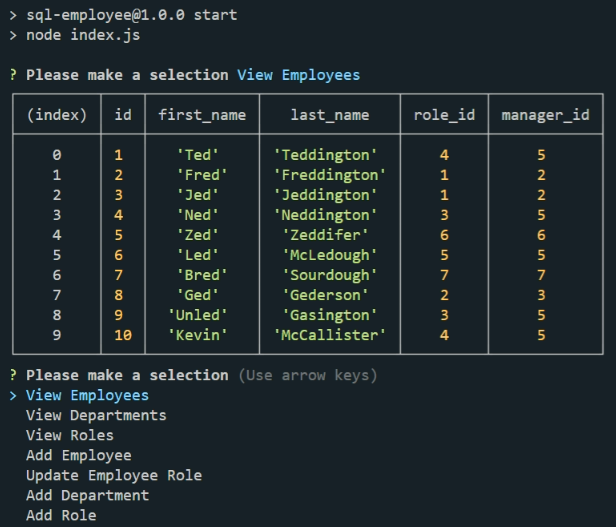

# SQL-employee

## App details:

- A command-line application that accepts user input
- When the user starts the application
  they are presented with the following options: view all departments, view all roles, view all employees, add a department, add a role, add an employee, and update an employee role
- When the user choose to view all departments they are presented with a formatted table showing department names and department ids
- When the user choose to view all roles they are presented with the job title, role id, the department that role belongs to, and the salary for that role
- When the user chooses to view all employees they are presented with a formatted table showing employee data, including employee ids, first names, last names, job titles, departments, salaries, and managers that the employees report to
- When the user chooses to add a department they are prompted to enter the name of the department and that department is added to the database
- When the user chooses to add a role they are prompted to enter the name, salary, and department for the role and that role is added to the database
- When the user chooses to add an employee they are prompted to enter the employee’s first name, last name, role, and manager, and that employee is added to the database
- When the user chooses to update an employee role they are prompted to select an employee to update and their new role and this information is updated in the database

### .env
You will need to install dotenv and then change the name of the "your.env" file to .env and enter your username and password into the pre-populated fields.

## Demo Link:

View the demo [HERE](https://drive.google.com/file/d/1TnMysHJcSfhUYgGffz8n0X5qBTvFt-Wb/view)

## Layout:

